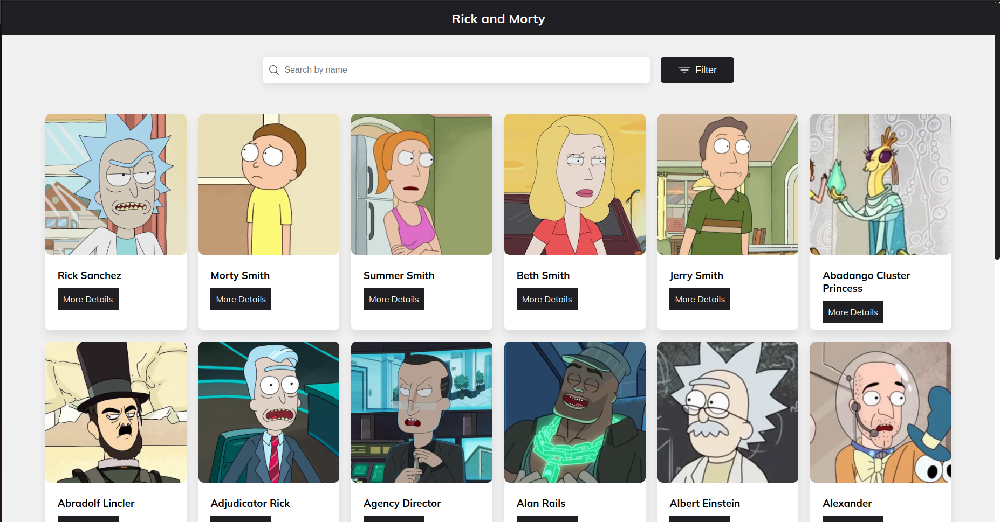

<h1 align="center"> Rick and Morty </h1>

  Desafio realizado proposto por uma vaga no qual me candidatei.

  <a href="#tecnologies">Tecnologias</a>&nbsp;&nbsp;&nbsp;|&nbsp;&nbsp;&nbsp;
  <a href="#project">Projeto</a>&nbsp;&nbsp;&nbsp;|&nbsp;&nbsp;&nbsp;
    <a href="#orientations">Orientações</a>&nbsp;&nbsp;&nbsp;|&nbsp;&nbsp;&nbsp;
  <a href="#challenges">Desafios</a>&nbsp;&nbsp;&nbsp;|&nbsp;&nbsp;&nbsp;
  <a href="#extres">Extras</a>&nbsp;&nbsp;&nbsp;|&nbsp;&nbsp;&nbsp;
  <a href="#license">Licença</a>

  

 

  

## 🚀 Tecnologias

 Esse projeto foi desenvolvido com as seguintes tecnologias: 

- HTML e SASS;
- Vue;
- [Vite](https://vitejs.dev/);
- NPM.

## 💻 Projeto

 O "Desafio Rick and Morty" é basicamente um website que consome a API Rick & Morty. Nele é possível encontrar features como campo de busca pelo nome de personagens da série, alguns filtros, paginação e mais.

## 🗺️ Orientações

 Você precisa ter apenas o NPM instalado em sua máquina para instalar as dependências necessárias.

<ul style="margin-left: 20px">
  <li> Execute em seu terminal o comando "npm install".</li>
  <li> Execute o comando "npm run dev" para rodar o projeto e depois acesse a rota exibida em seu terminal.</li>
</ul>

## ⚔️ Desafios enfrentados

 Também tive alguns desafios que para mim foram bem desafiadores, um deles foi realizar os filtros com os checkboxs, até então nunca tive que passar por um desafio como este, foi ótimo para praticar e aprender mais.

## 🧑‍🔧 Extras

 
    Fique a vontade para realizar qualquer tipo de mudança que você desejar.

## Licença

 Esse projeto está sob a licença MIT. 
